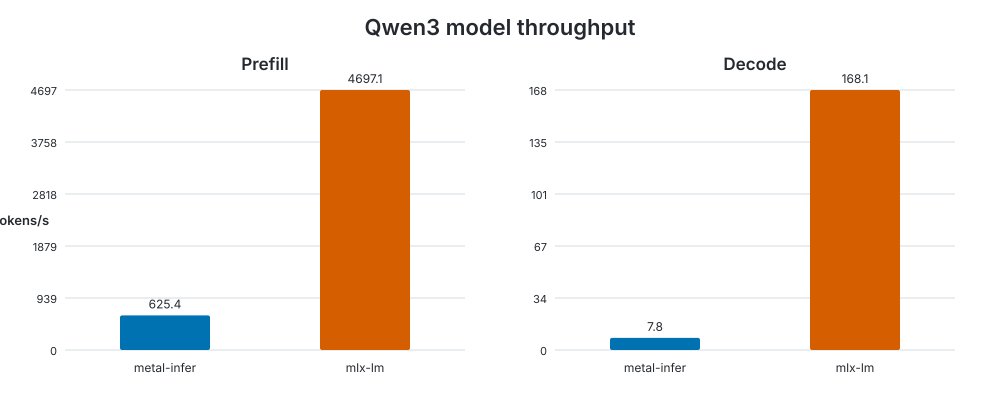

# Model benchmark

Generated at `2026-09-19T14:54:40.041377+00:00` on **Apple M4 Pro**.

- macOS: `26.6.2`
- Rust: `rustc 1.98.0 (88d9e12ae 2026-08-18)`
- metal-infer commit: `97dce6e2aad1203e6960d25fc8a02b5f4f1bc6b6`
- configuration: `warmup=1, iterations=5, prompt_tokens=512, generation_tokens=128`

| Backend | Prefill tokens/s | Decode tokens/s | Memory |
|---|---:|---:|---:|
| metal-infer | 625.439 | 7.818 | 1.266 GB allocated |
| mlx-lm | 4697.143 | 168.135 | 1.960 GB peak |

Memory values are not directly comparable: metal-infer reports Metal allocated memory while MLX reports peak memory.

Raw measurements: [results.json](results.json).

The benchmark methodology and reproduction commands are documented in the [benchmark guide](../../../README.md).
