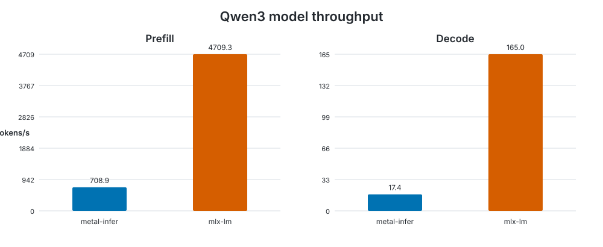

# Model benchmark

Generated at `2026-09-19T15:13:28.289950+00:00` on **Apple M4 Pro**.

- macOS: `26.6.2`
- Rust: `rustc 1.98.0 (88d9e12ae 2026-08-18)`
- metal-infer commit: `f89ab5a82453ba1372ca0860649976371e949d40`
- configuration: `warmup=1, iterations=5, prompt_tokens=512, generation_tokens=128`

| Backend | Prefill tokens/s | Decode tokens/s | Memory |
|---|---:|---:|---:|
| metal-infer | 708.896 | 17.369 | 1.268 GB allocated |
| mlx-lm | 4709.335 | 164.965 | 1.960 GB peak |

Memory values are not directly comparable: metal-infer reports Metal allocated memory while MLX reports peak memory.

Raw measurements: [results.json](results.json).

The benchmark methodology and reproduction commands are documented in the [benchmark guide](../../../README.md).
