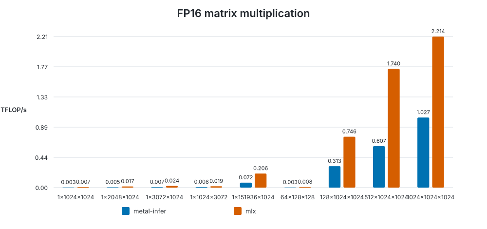

# Kernel benchmark

Generated at `2026-09-19T15:58:31.071539+00:00` on **Apple M4 Pro**.

- macOS: `26.6.2`
- Rust: `rustc 1.98.0 (88d9e12ae 2026-08-18)`
- metal-infer commit: `7f32524820ba263fb69b5176eed86633b1f1c419`
- configuration: `warmup=5, iterations=20`

| Shape (M×N×K) | Backend | Mean ms | TFLOP/s | Relative |
|---|---|---:|---:|---:|
| 1×1024×1024 | metal-infer | 0.698 | 0.0030 | 1.00× |
| 1×1024×1024 | mlx | 0.280 | 0.0075 | 2.49× |
| 1×2048×1024 | metal-infer | 0.868 | 0.0048 | 1.00× |
| 1×2048×1024 | mlx | 0.253 | 0.0166 | 3.44× |
| 1×3072×1024 | metal-infer | 0.945 | 0.0067 | 1.00× |
| 1×3072×1024 | mlx | 0.259 | 0.0243 | 3.65× |
| 1×1024×3072 | metal-infer | 0.768 | 0.0082 | 1.00× |
| 1×1024×3072 | mlx | 0.325 | 0.0193 | 2.36× |
| 1×151936×1024 | metal-infer | 4.306 | 0.0723 | 1.00× |
| 1×151936×1024 | mlx | 1.511 | 0.2060 | 2.85× |
| 64×128×128 | metal-infer | 0.700 | 0.0030 | 1.00× |
| 64×128×128 | mlx | 0.252 | 0.0083 | 2.78× |
| 128×1024×1024 | metal-infer | 0.857 | 0.3132 | 1.00× |
| 128×1024×1024 | mlx | 0.360 | 0.7458 | 2.38× |
| 512×1024×1024 | metal-infer | 1.768 | 0.6073 | 1.00× |
| 512×1024×1024 | mlx | 0.617 | 1.7401 | 2.87× |
| 1024×1024×1024 | metal-infer | 2.091 | 1.0268 | 1.00× |
| 1024×1024×1024 | mlx | 0.970 | 2.2136 | 2.16× |

Raw measurements: [results.json](results.json).

The benchmark methodology and reproduction commands are documented in the [benchmark guide](../../../README.md).
