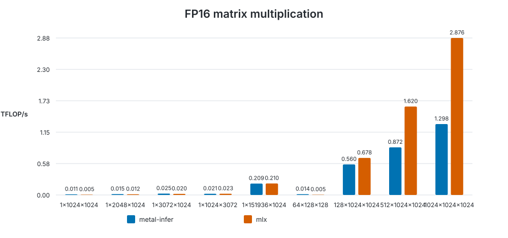

# Kernel benchmark

Generated at `2026-09-19T16:08:19.941065+00:00` on **Apple M4 Pro**.

- macOS: `26.6.2`
- Rust: `rustc 1.98.0 (88d9e12ae 2026-08-18)`
- metal-infer commit: `dc66e29be78a481ef4b4f8caaef2c5daa36e7e2d`
- configuration: `warmup=5, iterations=20`

| Shape (M×N×K) | Backend | Mean ms | GPU mean ms | TFLOP/s | Relative |
|---|---|---:|---:|---:|---:|
| 1×1024×1024 | metal-infer | 0.195 | 0.037 | 0.0107 | 1.00× |
| 1×1024×1024 | mlx | 0.386 | — | 0.0054 | 0.51× |
| 1×2048×1024 | metal-infer | 0.271 | 0.044 | 0.0155 | 1.00× |
| 1×2048×1024 | mlx | 0.336 | — | 0.0125 | 0.81× |
| 1×3072×1024 | metal-infer | 0.255 | 0.056 | 0.0247 | 1.00× |
| 1×3072×1024 | mlx | 0.319 | — | 0.0197 | 0.80× |
| 1×1024×3072 | metal-infer | 0.293 | 0.091 | 0.0215 | 1.00× |
| 1×1024×3072 | mlx | 0.278 | — | 0.0227 | 1.06× |
| 1×151936×1024 | metal-infer | 1.488 | 1.273 | 0.2091 | 1.00× |
| 1×151936×1024 | mlx | 1.479 | — | 0.2103 | 1.01× |
| 64×128×128 | metal-infer | 0.150 | 0.006 | 0.0140 | 1.00× |
| 64×128×128 | mlx | 0.442 | — | 0.0047 | 0.34× |
| 128×1024×1024 | metal-infer | 0.480 | 0.255 | 0.5596 | 1.00× |
| 128×1024×1024 | mlx | 0.396 | — | 0.6780 | 1.21× |
| 512×1024×1024 | metal-infer | 1.231 | 0.998 | 0.8723 | 1.00× |
| 512×1024×1024 | mlx | 0.663 | — | 1.6200 | 1.86× |
| 1024×1024×1024 | metal-infer | 1.654 | 1.413 | 1.2984 | 1.00× |
| 1024×1024×1024 | mlx | 0.747 | — | 2.8761 | 2.22× |

Raw measurements: [results.json](results.json).

The benchmark methodology and reproduction commands are documented in the [benchmark guide](../../../README.md).
