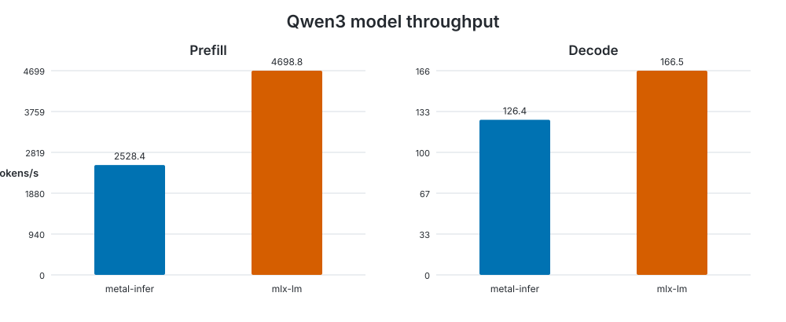

# Model benchmark

Generated at `2026-09-22T19:50:57.786122+00:00` on **Apple M4 Pro**.

- macOS: `26.7`
- Rust: `rustc 1.98.0 (88d9e12ae 2026-08-18)`
- metal-infer commit: `683bda832948e819a93e1fc86f9b7cf7edfb41c5`
- configuration: `warmup=1, iterations=5, prompt_tokens=512, generation_tokens=128`

| Backend | Prefill tokens/s | Prefill wall/GPU ms | Decode tokens/s | Decode wall/GPU ms | Memory |
|---|---:|---:|---:|---:|---:|
| metal-infer | 2528.431 | 202.497/201.328 | 126.448 | 1012.275/961.682 | 1.266 GB allocated, +0.000 MB measured |
| mlx-lm | 4698.752 | — | 166.475 | — | 1.960 GB peak |

Memory values are not directly comparable: metal-infer reports Metal allocated memory while MLX reports peak memory.

Raw measurements: [results.json](results.json).

The benchmark methodology and reproduction commands are documented in the [benchmark guide](../../../README.md).
