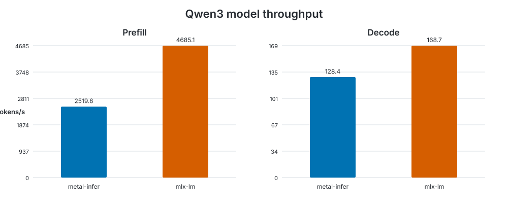

# Model benchmark

Generated at `2026-09-22T20:15:55.526398+00:00` on **Apple M4 Pro**.

- macOS: `26.7`
- Rust: `rustc 1.98.0 (88d9e12ae 2026-08-18)`
- metal-infer commit: `3ee2c92e7854d0283323d8bd4c47246485ed0c04`
- configuration: `warmup=1, iterations=5, prompt_tokens=512, generation_tokens=128`

| Backend | Prefill tokens/s | Prefill wall/GPU ms | Decode tokens/s | Decode wall/GPU ms | Memory |
|---|---:|---:|---:|---:|---:|
| metal-infer | 2519.602 | 203.207/202.297 | 128.445 | 996.537/947.460 | 1.266 GB allocated, +0.000 MB measured |
| mlx-lm | 4685.106 | — | 168.691 | — | 1.960 GB peak |

Memory values are not directly comparable: metal-infer reports Metal allocated memory while MLX reports peak memory.

Raw measurements: [results.json](results.json).

The benchmark methodology and reproduction commands are documented in the [benchmark guide](../../../README.md).
