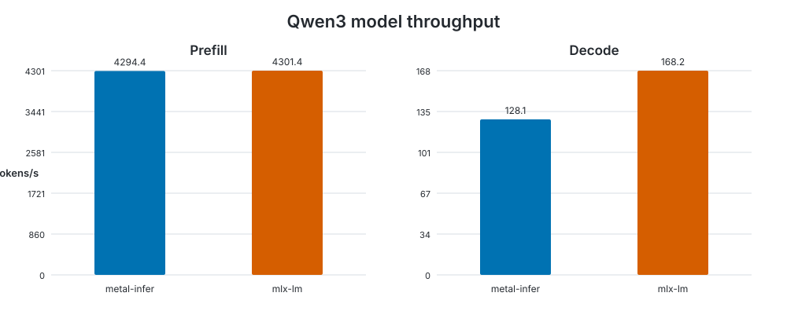

# Model benchmark

Generated at `2026-09-22T20:39:16.916617+00:00` on **Apple M4 Pro**.

- macOS: `26.7`
- Rust: `rustc 1.98.0 (88d9e12ae 2026-08-18)`
- metal-infer commit: `00d7ac8d1f6146875f4f4cc5a16027afbb74d870`
- configuration: `warmup=1, iterations=5, prompt_tokens=512, generation_tokens=128`

| Backend | Prefill tokens/s | Prefill wall/GPU ms | Decode tokens/s | Decode wall/GPU ms | Memory |
|---|---:|---:|---:|---:|---:|
| metal-infer | 4294.381 | 119.226/118.328 | 128.112 | 999.124/949.751 | 1.266 GB allocated, +0.000 MB measured |
| mlx-lm | 4301.434 | — | 168.201 | — | 1.960 GB peak |

Memory values are not directly comparable: metal-infer reports Metal allocated memory while MLX reports peak memory.

Raw measurements: [results.json](results.json).

The benchmark methodology and reproduction commands are documented in the [benchmark guide](../../../README.md).
