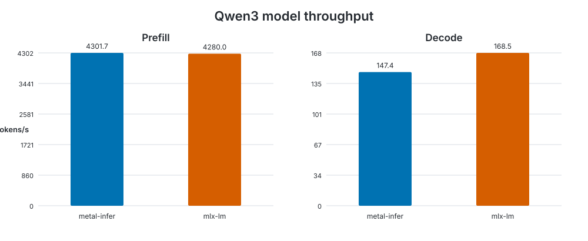

# Model benchmark

Generated at `2026-09-22T21:09:36.383762+00:00` on **Apple M4 Pro**.

- macOS: `26.7`
- Rust: `rustc 1.98.0 (88d9e12ae 2026-08-18)`
- metal-infer commit: `2c530171196f7fe6ee6d86214f072f6758eca244`
- configuration: `warmup=1, iterations=5, prompt_tokens=512, generation_tokens=128`

| Backend | Prefill tokens/s | Prefill wall/GPU ms | Decode tokens/s | Decode wall/GPU ms | Memory |
|---|---:|---:|---:|---:|---:|
| metal-infer | 4301.673 | 119.023/118.178 | 147.358 | 868.635/820.894 | 1.266 GB allocated, +0.000 MB measured |
| mlx-lm | 4280.043 | — | 168.472 | — | 1.960 GB peak |

Memory values are not directly comparable: metal-infer reports Metal allocated memory while MLX reports peak memory.

Raw measurements: [results.json](results.json).

The benchmark methodology and reproduction commands are documented in the [benchmark guide](../../../README.md).
