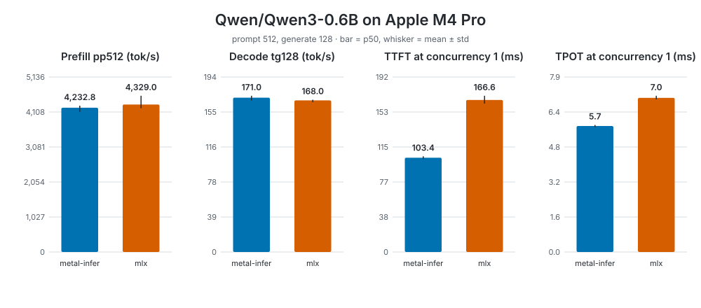

# Apple M4 Pro — Qwen/Qwen3-0.6B

2026-09-23T05:21:30.264477+00:00 · commit `0e16d651c3786edf368a80292de3136f5e32741c` · prompt 512, generate 128, 3 rounds

macOS 26.7 · 24 GB · Battery Power · mlx-lm 0.31.3, mlx 0.32.2



## Offline

| engine | pp512 tok/s p50 (p90/p99) | tg128 tok/s p50 (p90/p99) | mean ± std tg | MBU | MFU | peak GB | J/token |
|---|---|---|---|---|---|---|---|
| metal-infer | 4,232.8 (4,247.0/4,255.7) | 171.0 (171.8/174.1) | 170.5 ± 2.6 | 78.8 % | — | 1.29 | — |
| mlx | 4,329.0 (4,735.5/4,753.5) | 168.0 (168.6/168.8) | 167.4 ± 1.2 | 77.4 % | — | 1.96 | — |

## Server

p50 / p90 / p99 (mean ± std), milliseconds.

### Concurrency 1

| engine | TTFT | TPOT | ITL | E2EL | output tok/s | J/token |
|---|---|---|---|---|---|---|
| metal-infer | 103.4 / 103.6 / 108.5 (103.4 ± 1.4) | 5.7 / 5.7 / 5.8 (5.7 ± 0.0) | 5.8 / 5.9 / 6.3 (5.8 ± 0.1) | 830.0 / 832.8 / 847.1 (830.4 ± 6.3) | 154.3 | — |
| mlx | 166.6 / 172.4 / 175.9 (167.0 ± 4.2) | 7.0 / 7.1 / 7.2 (7.0 ± 0.1) | 7.0 / 7.3 / 8.6 (7.1 ± 0.4) | 1,054.5 / 1,075.8 / 1,083.9 (1,057.9 ± 12.6) | 121.3 | — |

### Concurrency 2

| engine | TTFT | TPOT | ITL | E2EL | output tok/s | J/token |
|---|---|---|---|---|---|---|
| metal-infer | 931.9 / 941.9 / 945.4 (830.1 ± 280.7) | 5.7 / 5.7 / 5.7 (5.7 ± 0.0) | 5.8 / 5.9 / 6.0 (5.8 ± 0.1) | 1,657.6 / 1,666.1 / 1,673.2 (1,556.2 ± 280.5) | 154.2 | — |
| mlx | 293.6 / 296.5 / 299.0 (292.8 ± 4.1) | 7.5 / 7.6 / 7.6 (7.5 ± 0.0) | 7.4 / 7.6 / 10.3 (7.6 ± 1.1) | 1,244.2 / 1,257.0 / 1,261.3 (1,245.1 ± 7.6) | 205.8 | — |

### Concurrency 4

| engine | TTFT | TPOT | ITL | E2EL | output tok/s | J/token |
|---|---|---|---|---|---|---|
| metal-infer | 2,590.6 / 2,600.6 / 2,602.7 (1,971.2 ± 924.5) | 5.7 / 5.7 / 5.7 (5.7 ± 0.0) | 5.8 / 5.9 / 6.0 (5.8 ± 0.1) | 3,318.4 / 3,327.1 / 3,328.5 (2,698.0 ± 924.8) | 154.2 | — |
| mlx | 541.8 / 547.6 / 550.0 (542.6 ± 4.3) | 8.8 / 8.9 / 8.9 (8.8 ± 0.0) | 8.6 / 9.0 / 14.7 (8.9 ± 2.1) | 1,661.6 / 1,671.5 / 1,674.8 (1,662.3 ± 7.7) | 308.1 | — |

### Concurrency 8

| engine | TTFT | TPOT | ITL | E2EL | output tok/s | J/token |
|---|---|---|---|---|---|---|
| metal-infer | 3,005.7 / 5,636.2 / 5,901.3 (3,003.6 ± 1,936.0) | 5.7 / 5.7 / 5.7 (5.7 ± 0.1) | 5.8 / 5.9 / 6.2 (5.7 ± 0.1) | 3,731.5 / 6,350.3 / 6,623.2 (3,726.7 ± 1,932.0) | 154.9 | — |
| mlx | 1,034.2 / 1,086.3 / 1,086.6 (1,049.9 ± 26.3) | 11.1 / 11.4 / 11.5 (11.2 ± 0.2) | 10.7 / 11.5 / 24.2 (11.3 ± 4.6) | 2,476.4 / 2,506.4 / 2,511.3 (2,468.4 ± 32.1) | 411.8 | — |

## Setup

| parameter | value |
|---|---|
| model | `Qwen/Qwen3-0.6B` |
| MLX model | `Qwen/Qwen3-0.6B` |
| engines | metal-infer, mlx |
| candidates | none |
| modes | offline, server |
| prompt / generated tokens | 512 / 128 |
| iterations per offline run | 5 |
| rounds (engine order reversed every other round) | 3 |
| cooldown after each run | 30 s |
| peak bandwidth for MBU | 273.0 GB/s |
| peak FP16 TFLOPS for MFU | — |
| energy | not measured |
| parameters read per token | 595,984,384 |
| weight bytes read per token | 1.192 GB |
| KV bytes per context token | 114,688 |
| chip / memory | Apple M4 Pro / 24 GB |
| macOS | 26.7 |
| power source | Now drawing from 'Battery Power' |
| thermal state | Note: No thermal warning level has been recorded; Note: No performance warning level has been recorded; Note: No CPU power status has been recorded |
| metal-infer commit | `0e16d651c3786edf368a80292de3136f5e32741c` |
| MLX versions | mlx-lm 0.31.3, mlx 0.32.2 |
| server concurrency levels | 1, 2, 4, 8 |
| requests per level | 8 |
| server prompt | fixed English text repeated 5 times, unique prefix per request, greedy, `ignore_eos` |

Offline: pp = prompt tokens / prefill time and tg = generated tokens / decode time, one sample per iteration; MBU = (weight bytes + KV bytes × (prompt + generated / 2)) × tg p50 / peak bandwidth.

### Commands

```sh
/Users/ljahier/Lab/playground/objc-phase0/target/release/metal-infer-bench --model Qwen/Qwen3-0.6B --prompt 512 --generate 128 --iterations 5
uvx --from mlx-lm==0.31.3 --with mlx==0.32.2 mlx_lm.benchmark --model Qwen/Qwen3-0.6B -p 512 -g 128 -n 5
/Users/ljahier/Lab/playground/objc-phase0/target/release/metal-infer serve --model Qwen/Qwen3-0.6B --bind 127.0.0.1:8931
uvx --from mlx-lm==0.31.3 --with mlx==0.32.2 mlx_lm.server --model Qwen/Qwen3-0.6B --host 127.0.0.1 --port 8931
```

### Plan — metal-infer

| key | value |
|---|---|
| `attention` | `tiled` |
| `flash_decode.blocks` | `1024:64,3072:128,256` |
| `fusion.add_rms_norm` | `on` |
| `fusion.decode_norm` | `on` |
| `fusion.gate_up` | `on` |
| `fusion.qk_rope_cache` | `on` |
| `fusion.qkv` | `on` |
| `gemv.config` | `tuned` |

Raw measurements: [results.json](results.json). Protocol and metrics: [benchmark guide](../../../README.md).
